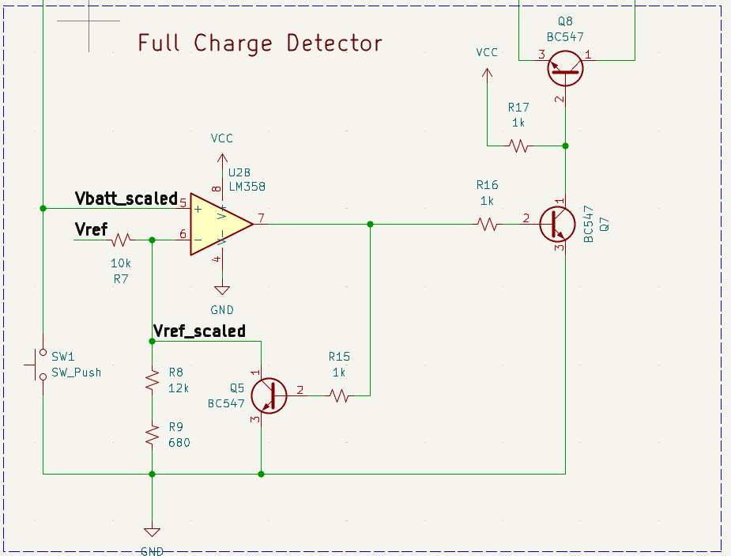

# Op-Amp Based Lithium Charger
  

***Figure 1: Li-ion/LiPo Battery Charger on a Breadboard***  

This is a Li-ion/LiPo charger built using operational amplifiers. It works by supplying a constant current to the battery and stopping the charge once the battery reaches a set voltage. In this test, a Li-ion battery with a full-charge voltage of 4.2V is used. As seen in ***Video 1***, when the battery voltage reached about 4.198V (shown on the left multimeter), the circuit stopped charging, which is indicated by the red LED turning off. You’ll also notice the battery voltage dropped slightly after charging stopped. That’s why the circuit includes some hysteresis (explained later) to prevent it from turning back on right away.  

  

***Video 1: Lithium Battery Charger in Action***  

The charging current is constant at 570 mA, as shown on the multimeter in the back. But you may ask, “Isn’t the meter showing voltage, not current?” And you’d be right. But one way to measure current is by measuring the voltage across a current-sensing resistor (Rsense), which usually has a low resistance to minimize power loss. Then, using Ohm’s law, ***I = V / Rsense***. This is actually how the circuit measures and controls the current through the battery: by keeping the voltage across Rsense constant, the current through Rsense, and the battery, stays constant. I used two 2 Ω resistors in parallel, so Rsense = 1 Ω. That gives us: ***Charging current = Vselect / Rsense = 0.570 V / 1 Ω = 570 mA***, where Vselect is the voltage we can adjust to change the charging current.  

Another cool feature of this charger is its ability to supply a low current to revive a dead battery, that is, one that’s been over-discharged below 3 V. When the circuit starts up, it checks the battery voltage. If it’s below 3 V, the circuit charges the battery at a much lower current than normal. Once the battery voltage rises above 3 V, the circuit switches back to the regular charging current. To test this feature, I simulated an over-discharged cell using a regular diode, which gave a voltage of around 0.7 V, well below 3 V. I didn’t have an over-discharged battery on hand because, in reality, you should never let lithium batteries drop that low, as it degrades them quickly. So this phase is rarely used.  

   

***Figure 2: Overdischarged Cell Simulation***  

Figure 2 shows the circuit detects the low voltage, 0.783V, (shown on the left multimeter) and supplies only about 70 mA to charge the “battery” (shown on the right meter).  

## [Schematic](schematic.pdf)  

  

***Figure 3: Battery Charger***  

### A) Ideal Diode Circuit  

  

***Figure 4: Battery Charger - Ideal Diode Circuit***  

Normally, a diode is placed at the output of the circuit to prevent the battery from pushing current back into the circuit when the power supply is disconnected. However, placing a regular diode in series with the battery can waste a lot of power. Let’s say we charge the battery at 500 mA, and the voltage drop across the diode is around 0.7–0.8 V. The power wasted would be:  

***P = V × I = 0.7 V × 0.5 A = 0.35 W!***  

That will make the diode heat up quite a bit. A Schottky diode is better because it has a lower voltage drop, around 0.2–0.4 V, so it wastes less power. Still, the power loss is noticeable if we want to charge the battery at high current. The solution is this (probably unnecessarily complicated) “ideal diode” circuit. As the name suggests, this circuit acts like a diode with zero (or very low) voltage drop, so almost no power is wasted, while still blocking current from flowing back from the battery. The N-MOSFET Q4 acts as this ideal diode. When the battery is connected to the drain (pin 2), Q4 blocks current from flowing backward. When Vcc is present, Q4 turns ON and allows current to flow into the battery and power the rest of the circuit.  

Since Q4 is used as a high-side switch (its source, pin 3, is not connected to ground), we need a voltage higher than Vcc to drive the gate. Remember, an N-MOSFET turns ON when the gate voltage is higher than the source voltage by at least the threshold voltage. To do this, I built a simple boost converter using a 555 timer.  

The 555 timer is configured to generate a 21 kHz square wave. This signal drives the NPN transistor Q3, which energizes inductor L1. L1 then transfers energy to output capacitor C3 many times per second, creating a voltage higher than the input. In my case, with a 21 kHz frequency and R11 set to 12 kΩ, I was able to generate about 16 V at Q4’s gate (pin 1), which is more than enough to fully turn on the MOSFET. (The gate’s max voltage is 20 V.)
One problem I ran into was that when Q4 was ON and Vcc was removed, the gate voltage didn’t drop fast enough. This allowed current from the battery to flow back through the MOSFET and into the rest of the circuit, keeping the 555 timer and boost converter ON and the MOSFET never turned OFF. To fix this, I made sure the 555 timer only turns ON when Vcc is at 5 V or higher. I did this using Q1 and Q2. If the battery tries to power the circuit, its voltage isn’t high enough to activate Q1, so Q2 also stays off, which disconnects the timer from the battery and prevents Q4 from turning back on. I’ll admit this solution is far from perfect.  

### B) Reference Voltage Source  

  

***Figure 5: Battery Charger - Reference Voltage Source***  

As the name suggests, this circuit generates a relatively stable reference voltage that is used by different parts of the charger. This is useful when the input voltage from the power supply fluctuates. It also allows the charger to work with input voltages other than 5 V (within a certain range, of course).
Vref is set by resistors R21, R22, and R23. For more details, you can check the TL431 datasheet from Texas Instruments: https://www.ti.com/lit/ds/symlink/tl431.pdf  

### C) Battery Monitor  

  

***Figure 6: Battery Charger - Battery Monitor / Op-amp Subtractor***  

This circuit measures the voltage across the battery. You may have noticed that the negative terminal of the battery is not connected to ground. That means you can't just measure the battery voltage by checking the positive terminal, which is actually just Vcc.  

So, what we can do instead is measure the battery voltage by subtracting the voltage at the negative terminal from the voltage at the positive terminal.
There's another issue. The operational amplifier I'm using is not rail-to-rail, which means its output can’t reach all the way up to Vcc (5 V). In fact, the highest it can go is around 3.8 V. But the battery can reach up to 4.2 V when fully charged. To solve this, I scale down the battery voltage and use the scaled voltage in the rest of the circuit. So,  

***Vbatt_scaled = (Vbatt+ − Vbatt−) × R10 / R13***, where R12 = R10 and R14 = R13.  

This scaled voltage, Vbatt_scaled, is used by the full-charge detector to know when to stop charging, and also by the current regulator to decide whether to provide normal charging current or low current to revive a dead cell.  

### D) Current Regulator

  

***Figure 7: Battery Charger - Current Regulator Circuit***  

To understand this circuit, you only need to keep in mind two things:  

1) The ON resistance RDS​ of a MOSFET depends on the gate-to-source voltage VGS​. The higher VGS​, the lower RDS.
2) The output of an operational amplifier is: ***Vout = A(V+ − V-)***, where A is the internal gain of the amplifier (very high, about 1000!). Of course, the output is limited by the supply voltage. So if the op-amp is powered with 5 V, the output can only swing between 0 V and about 3.8 V.
Now, if V- increases, Vout decreases. If V- decreases, Vout​ increases. Also note that for the op-amp to control MOSFET Q6 properly, its output must not be saturated (i.e., stuck at Vcc or 0 V). This means that V+ and V- must be very close to each other to keep Vout within its linear range. So if we set V+ to a fixed value, V- will try to follow V+.

Alrighty, now we’re ready to look at the circuit. When the current through MOSFET Q6 increases, the voltage across Rsense​, which is also V-, also increases, because: ***V- = Rsense × Icharge***, where Rsense is constant. As discussed, if V- increases, then Vout​ of op-amp U3A decreases, because: ***Vout = A(V+ − V-)***. This output also controls the gate of Q6 (through an NPN transistor, which I’ll explain later). As Vout​ drops, VGS​ of Q6 also drops. This increases the RDS​ of Q6, which limits the charging current.  

On the other hand, if the charging current decreases, V- decreases, Vout of U3A increases and so is VGS of Q6. Thus RDS of Q6 decreases and allows more current to flow through.  

The charge current is calculated like this:  

***Icharge = V- / Rsense = V+ / Rsense = 570mA***, where:  

V+ = Vref x R24 / (R24 + R26) = 0.570V,  

Vref = 4.2V,  

Rsense = 1Ω  

When the battery is below 3 V (over-discharged), op-amp U3B activates Q9. This connects R25 to GND, which lowers V+ to:  

***V+ = Vref x (R24||R25) / [(R24||R25) + R26] = 0.070V***, so  

***Icharge = V+ / Rsense = 70mA***  

### E) Full Charge Detector  

  

***Figure 8: Battery Charger - Full Charge Circuit***  

Lastly, the full charge detector, well, detects when the battery is fully charged and stops the charging process. Op-amp U2B compares the scaled battery voltage, Vbatt_scaled, with a scaled reference voltage, which we’ll call Vref_scaled.  

***Vref_scaled = Vref x (R8 + R9) / (R8 + R9 + R7) = 2.348V***  

And when the battery is fully charged, its voltage is 4.2V, so  

***Vbatt_scaled = 4.2V x R10 / R13 = 4.2V * 5.6k / 10k = 2.352V***  

When Vbatt_scaled exceeds Vref_scaled, U2B activates Q7, which pulls the base of Q8 LOW, turning it off. Q8 then disconnects MOSFET Q6 from the current regulator. Q6 also turns off due to the pull-down resistor R19, stopping current flow to the battery.

